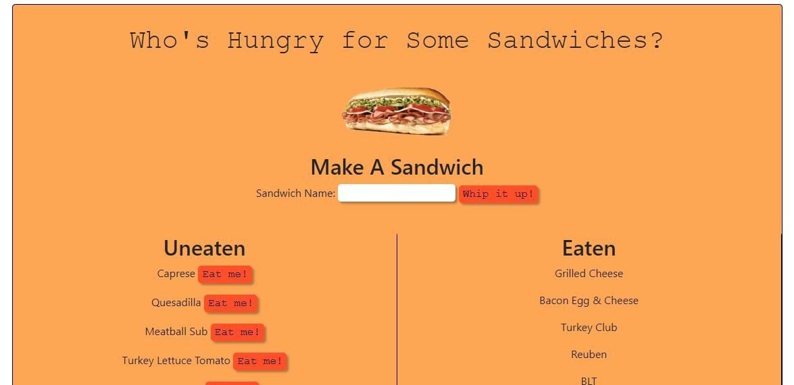

# Sandwich Logger

The Sandwich Logger is a restaurant app made with MySQL, Node, Express, Handlebars and a homemade ORM (yum!). Following the MVC design pattern, it uses Node and MySQL to query and route data in the app, and Handlebars to generate HTML.

Visit deployed site [here.](https://sandwich-logger.herokuapp.com/)

## Screenshot

## Usage

1. Once you have cloned the repo, run `npm install` to install dependencies.

2. Create the MySQL database and add data from seeds.sql

`mysql -u <username>`
`source schema.sql`
`source seeds.sql`

## Contributors

\*[Jordyn Saltzman](https://github.com/jordynsaltzman)

## License

MIT License

Copyright (c) 2020 Jordyn Saltzman

Permission is hereby granted, free of charge, to any person obtaining a copy of this software and associated documentation files (the "Software"), to deal in the Software without restriction, including without limitation the rights to use, copy, modify, merge, publish, distribute, sublicense, and/or sell copies of the Software, and to permit persons to whom the Software is furnished to do so, subject to the following conditions:

The above copyright notice and this permission notice shall be included in all copies or substantial portions of the Software.

THE SOFTWARE IS PROVIDED "AS IS", WITHOUT WARRANTY OF ANY KIND, EXPRESS OR IMPLIED, INCLUDING BUT NOT LIMITED TO THE WARRANTIES OF MERCHANTABILITY, FITNESS FOR A PARTICULAR PURPOSE AND NONINFRINGEMENT. IN NO EVENT SHALL THE AUTHORS OR COPYRIGHT HOLDERS BE LIABLE FOR ANY CLAIM, DAMAGES OR OTHER LIABILITY, WHETHER IN AN ACTION OF CONTRACT, TORT OR OTHERWISE, ARISING FROM, OUT OF OR IN CONNECTION WITH THE SOFTWARE OR THE USE OR OTHER DEALINGS IN THE SOFTWARE.
